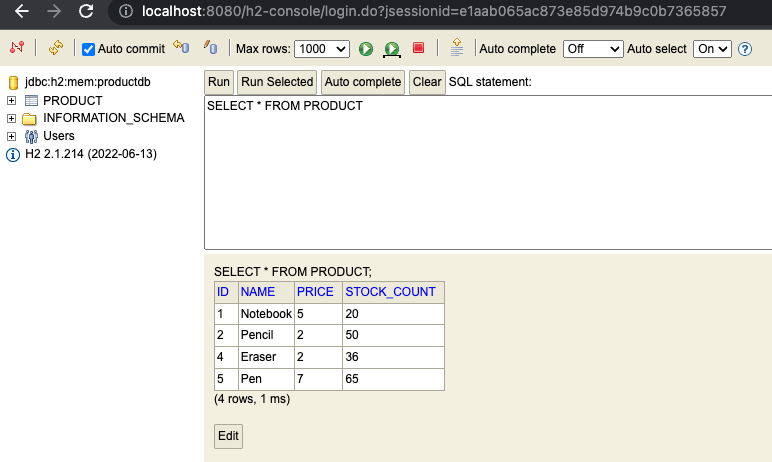

# JPA and Hibernate

## Introduction

In Spring, JPA and Hibernate are often used together to provide a comprehensive solution for managing relational data in Java applications. Spring provides several tools for integrating JPA and Hibernate, such as the Spring Data JPA module, which provides a higher-level abstraction over JPA and Hibernate, and the HibernateTemplate class, which simplifies the use of Hibernate within Spring applications.

### JPA
JPA (Java Persistence API) is a specification for ORM (Object-Relational Mapping) frameworks in Java. JPA defines a standard way to map Java objects to relational database tables, and provides a set of APIs for developers to interact with the database using a high-level object-oriented approach.

In Spring Boot, JPA is often used in conjunction with Hibernate as the underlying ORM framework. Spring Boot provides integration with JPA through the Spring Data JPA module, which provides a set of abstractions and APIs that make it easy to work with JPA.

### Hibernate
Hibernate is an Object-Relational Mapping (ORM) framework that is commonly used in Java applications to map Java objects to relational database tables. It provides a way to interact with a database using an object-oriented paradigm, which is often more intuitive and easier to work with than SQL statements.

In a Spring Boot application, Hibernate can be used as a persistence layer to interact with a database. Spring Boot provides integration with Hibernate through its Spring Data JPA module, which provides a set of abstractions and APIs to simplify database access and reduce boilerplate code.

## Hibernate vs JPA


Here are some key differences between Hibernate and JPA:

- Implementation: Hibernate is an implementation of the JPA specification, while JPA is just a specification. This means that Hibernate provides a superset of JPA functionality, and can be used as a drop-in replacement for JPA.

- Flexibility: Hibernate provides a lot more flexible and powerful ORM solution than JPA, and can be used to implement advanced features such as caching, lazy loading, and inheritance mapping. JPA is a simpler and more standardized approach to ORM, and is a good choice if you need to stick to a strict specification.


## Configuring ORM in Spring Boot

### Add dependencies
```
<dependency>
    <groupId>org.springframework.boot</groupId>
    <artifactId>spring-boot-starter-web</artifactId>
</dependency>
<dependency>
    <groupId>org.springframework.boot</groupId>
    <artifactId>spring-boot-starter-data-jdbc</artifactId>
</dependency>
<dependency>
    <groupId>org.springframework.boot</groupId>
    <artifactId>spring-boot-starter-data-jpa</artifactId>
</dependency>
<dependency>
    <groupId>com.h2database</groupId>
    <artifactId>h2</artifactId>
</dependency>
```

### Configure the datasource

In this example, the H2 database is used as the Datasource. Configure it by adding the following configurations to `application.properties`.   
```
spring.h2.console.enabled=true
spring.datasource.url=jdbc:h2:mem:testdb
```

### Create the Table

Add the sql file(`schema.sql`) with `create table` in the resources directory. This will create the table in the DB. This will run the create table command on startup and create the Table in the H2 Database when the application starts up.
```sql
 CREATE TABLE PRODUCT (
    id int,
    name varchar,
    price int,
    stockCount int );
```


### Define the Entity

Create a class with fields that can be mapped to the table fields. Annotate it with @Entity annotation and mark the Id. Then map each field to the corresponding table column if the name differs. Also define the constructor, getters and setters for every field.

```java
@Entity
public class Product {

    @Id
    int id;
    @Column(name="name")
    String name;
    @Column(name="price")
    int price;
    @Column(name="stockCount")
    int stockCount;
    
    Product(){}
    
    public Product(int id, String name,  int price, int stockCount) {
        this.name = name;
        this.id = id;
        this.price = price;
        this.stockCount = stockCount;
    }
    // getters and setters
``` 

### Create the Spring Data JPA interface

 Spring Data JPA used here is a part of the Spring Data project, which provides a set of abstractions and APIs to simplify database access in Spring Boot applications. Spring Data JPA builds on top of JPA and provides additional functionality, such as the ability to generate database queries automatically based on method names.

 Create an interface that extends the JpaRepository interface. Pass the Entity class and datatype of the id to the interface as demostrated in the example below.

```java
public interface ProductSpringDataJpa extends JpaRepository<Product, Integer> {
}
```

### Create the Command Line Runner class

The Command Line Runner is an interface provided by the Spring Boot framework that allows developers to execute code on application startup. The interface provides a single run() method, which is called by the Spring Boot application once the ApplicationContext is loaded and ready.

To use the Command Line Runner, create a class that implements the CommandLineRunner interface and override the run() method with desired logic. The class can then be annotated with the @Component annotation or registered as a bean in the Spring Boot application context. The following code snippet inserts 5 rows of data into the table and then deletes the row with id 3.
```java
@Component
public class ProductCommandLineRunner implements CommandLineRunner {
     @Autowired
    ProductSpringDataJpa productSpringDataJpa;

    @Override
    public void run(String... args) throws Exception {
        productSpringDataJpa.save(new Product(1, "Notebook", 5, 20));
        productSpringDataJpa.save(new Product(2, "Pencil", 2, 50));
        productSpringDataJpa.save(new Product(3, "Sharpener", 4, 45));
        productSpringDataJpa.save(new Product(4, "Eraser", 2, 36));
        productSpringDataJpa.save(new Product(5, "Pen", 7, 65));

        productSpringDataJpa.deleteById(3l);
    }
}
```
Final output



