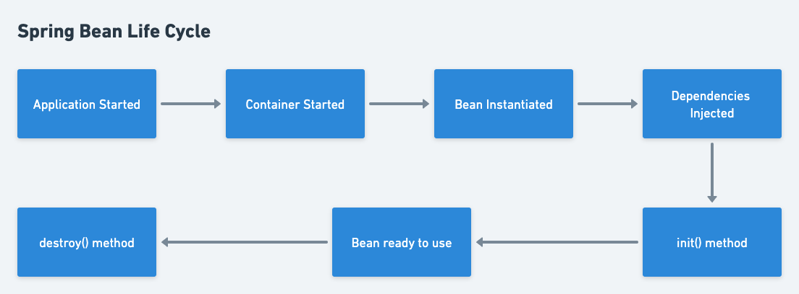

# Introduction to Spring

## Inversion of Control

Inversion of Control is a principle in Software Engineering that transfer control of objects or portion of code to a framework or container.

Spring IoC(Inversion of Control) Container is the core of Spring Framework. It takes control of the program by creating objects, managing dependencies and lifecycles.
In traditional programming, our custom code makes calls to libraries to implement features and our code controls teh flow of the program. But with IoC, frameworks or containers call our custom code and control the flow of the program.

## Dependency Injection

Dependency Injection is a design pattern in Software Engineering used to implement IoC. It transfers the responsibility of creating objects to Spring Framework. DI makes the code more modular, testable, and maintainable by reducing coupling between classes and enabling easier unit testing.
There are three types of Dependency Injection:
* Constructor Injection:  The container provides the dependencies by invoking a constructor with the necessary arguments.
* Setter Injection: The container will use setter methods of the class after invoking a no argument constructor, to instantiate the class.
* Field Injection: The dependencies of a class are injected into its fields rather than its constructor or setter methods.

## Bean Life Cycle

In Spring, a bean's lifecycle consists of several stages, each with its own set of methods that can be executed. The following is a general overview of the bean lifecycle stages and the corresponding methods:



1. Bean instantiation: This is the first stage of the bean lifecycle.bThe container creates an instance of the bean using its constructor or a factory method, depending on how the bean is defined.

2. Dependency injection*: The container injects any required dependencies into the bean instance.

3. Initialization*: The init method is a callback method that you can define for a bean to perform any custom initialization logic. This method is executed after the bean has been instantiated and all its dependencies have been injected, but before the bean is ready to be used.
To define an init method for a bean, you can use the @PostConstruct annotation on a method in the bean class.

4. Destruction*: This stage occurs when the bean is no longer needed, and the container wants to dispose of the bean. The following methods are executed during this stage:
    
    - DisposableBean.destroy(): This method is called before the bean is destroyed, giving it an opportunity to release any resources it is holding.
    
    -   Custom destroy method: You can define a custom destroy method by specifying a method name in the bean configuration.

## Configuring Spring Application
Spring applications can be configured using XML files, Java-based configuration, or a combination of both.

### XML-based
XML-based configuration involves defining beans, dependencies, and their properties in an XML file.
An XML-based configuration file would look like the following:

```xml
<?xml version="1.0" encoding="UTF-8"?>
<beans xmlns="http://www.springframework.org/schema/beans"
    xmlns:xsi="http://www.w3.org/2001/XMLSchema-instance"
    xsi:schemaLocation="
        http://www.springframework.org/schema/beans http://www.springframework.org/schema/beans/spring-beans.xsd">

    <!-- bean definitions here -->
    <bean id="..." class="..."> </bean>

</beans>
```

### Java-based
Java-based configuration uses Java classes to define beans and their dependencies.

This approach has several benefits, including:

* Type safety: Java-based configuration uses Java classes, which are strongly typed, making it less error-prone than XML-based configuration.

* Ease of refactoring: As Java-based configuration is based on classes, it is easier to refactor code without worrying about updating XML files.

* Better IDE support: IDEs such as Eclipse and IntelliJ IDEA provide better support for Java code than XML files.

To configure a Spring application using Java-based configuration, create a class annotated with the @Configuration annotation. This class will contain one or more methods annotated with the @Bean annotation, which will define the beans that make up the application.

```
//TODO: add code sample
```

## Spring Boot Auto Configuration

Spring Boot is an open-source framework for building enterprise-level Java applications quickly and easily. It's built on top of Spring framework, and provides a streamlined, opinionated approach to application development, with a focus on ease of use and rapid development. Spring Boot's auto-configuration feature allows developers to easily configure their applications without having to write a lot of boilerplate code. It automatically configures many of the commonly used components, such as data sources, security, and web frameworks. Spring Boot auto-configuration works by scanning the classpath for certain libraries and components, and configuring the application based on what it finds. For example, if the classpath contains a database driver, Spring Boot will automatically configure a DataSource bean.

Auto-configuration can also be customized and extended by providing custom configuration classes. These classes can be annotated with `@Configuration` and can contain `@Bean` methods that override or augment the auto-configured beans. You need to opt-in to auto-configuration by adding the `@EnableAutoConfiguration` or `@SpringBootApplication` annotations to one of your `@Configuration` classes.

## Spring Expression Language (SpEL)
Spring Expression Language, or SpEL for short, is a powerful expression language that is used in Spring applications for configuring and manipulating objects. It provides a way to dynamically evaluate and manipulate expressions at runtime, which can be useful in a variety of contexts, such as configuration files, annotations, and data binding.

SpEL supports a wide range of features, including:

-  **Property access**: SpEL allows you to access object properties using a syntax similar to that of Java. For example, suppose you have a Java object called "person" with two properties: "firstName" and "lastName". You can access these properties in SpEL using the following syntax:
```bash 
#{person.firstName}
#{person.lastName}
```
In this example, the `#` character indicates that this is an expression that should be evaluated at runtime, and the `.` character is used to access the object properties.

-  **Method invocation**: SpEL allows you to invoke methods on objects using a syntax similar to that of Java. For example, suppose you have a Java object called "calculator" with a method called "add" that takes two parameters. You can invoke this method in SpEL using the following syntax:
```bash
#{calculator.add(2, 3)}
```
In this example, the `()` characters are used to indicate that this is a method invocation, and the parameters are passed inside the parentheses

-  **Conditional expressions**: SpEL allows you to use conditional expressions to perform conditional logic, such as if-else statements. For example, suppose you have a Java object called "person" with a property called "age". You can use a conditional expression in SpEL to check if the person is over 18 years old:
```bash
#{person.age >= 18 ? 'Adult' : 'Minor'}
```
In this example, the `?` and `:` characters are used to indicate the if-else logic. If the person's age is greater than or equal to 18, the expression will evaluate to "Adult". Otherwise, it will evaluate to "Minor".

-  **Mathematical and logical operators**: SpEL supports a wide range of mathematical and logical operators, such as +, -, *, /, %, &&, ||, and !. For example, you can perform basic arithmetic operations in SpEL using the following syntax:
```bash
#{2 + 3}
#{10 - 5}
#{2 * 4}
#{10 / 2}
```

-  **Regular expressions**: SpEL supports regular expressions, which can be used for pattern matching and data validation. For example, you can use a regular expression in SpEL to validate that an email address is in the correct format: 
```bash
#{email.matches('[a-zA-Z0-9._%+-]+@[a-zA-Z0-9.-]+\.[a-zA-Z]{2,}')}
```
In this example, the `matches` method is used to check if the email address matches the specified regular expression.

## Profiles
Profiles in Spring Boot provide a way to define different sets of configurations for different environments or deployment scenarios. With profiles, you can configure your application to behave differently depending on the environment it is running in, such as development, testing, staging, or production.

To define a profile in Spring Boot, you can use the @Profile annotation. This annotation can be added to any bean definition, indicating that the bean should only be created when the specified profile is active. For example, suppose you have a bean called "myService" that should only be created when the "dev" profile is active. You can define the bean as follows:
```java
@Service
@Profile("dev")
public class MyService {
  // ...
}
```

In this example, the @Service annotation indicates that this is a service bean, and the @Profile("dev") annotation indicates that the bean should only be created when the "dev" profile is active.

To activate a profile in Spring Boot, you can use the spring.profiles.active property. This property can be set in a variety of ways, such as through a configuration file, a system property, or an environment variable. For example, to activate the "dev" profile, you can set the spring.profiles.active property in your application.properties file as follows:
```
spring.profiles.active=dev
```

## Aspect Oriented Programming

Aspect-Oriented Programming(AOP) is a programming paradigm that allows you to modularize cross-cutting concerns in your application. In Spring, AOP is implemented using AspectJ, which provides a powerful set of tools for defining and applying aspects to your application.

One of the key concepts in AOP is the notion of a pointcut, which is a set of joinpoints where you can apply an aspect. A joinpoint is a specific point in the execution of your application, such as a method invocation or a field access. By defining a pointcut, you can specify the set of joinpoints where you want to apply an aspect.

In Spring, you can define a pointcut using a combination of a pointcut expression and a pointcut designator. The pointcut expression is a SpEL expression that specifies the joinpoints that match the pointcut, and the pointcut designator specifies the types of joinpoints that the pointcut applies to.

For example, suppose you have a `MyService` class that contains several methods, and you want to log the entry and exit of each method. You can define a pointcut that matches all public methods of the `MyService` class, like this:
```java
@Pointcut("execution(public * com.example.MyService.*(..))")
public void myServiceMethods() {}
```

In this example, the `@Pointcut` annotation is used to define a pointcut called `myServiceMethods`. The SpEL expression `execution(public * com.example.MyService.*(..))` specifies that the pointcut applies to all public methods of the `MyService` class.

Once you have defined a pointcut, you can apply an aspect to it using an advice. An advice is a piece of code that is executed at a specific joinpoint, such as before or after a method invocation. In Spring, you can define an advice using an aspect, which is a class that contains one or more advice methods.

For example, suppose you have a `LoggingAspect` class that contains advice methods for logging the entry and exit of methods. You can apply the `LoggingAspect` to the `myServiceMethods` pointcut, like this:
```java
@Aspect
@Component
public class LoggingAspect {
    @Before("myServiceMethods()")
    public void logMethodEntry(JoinPoint joinPoint) {
        String methodName = joinPoint.getSignature().getName();
        System.out.println("Entering " + methodName);
    }

    @AfterReturning("myServiceMethods()")
    public void logMethodExit(JoinPoint joinPoint) {
        String methodName = joinPoint.getSignature().getName();
        System.out.println("Exiting " + methodName);
    }
}
```

In this example, the `@Aspect` annotation is used to define the LoggingAspect as an aspect. The `@Before` and `@AfterReturning` annotations are used to define advice methods that are executed before and after a method invocation, respectively. The `myServiceMethods()` pointcut is used to specify the joinpoints where the aspect should be applied.