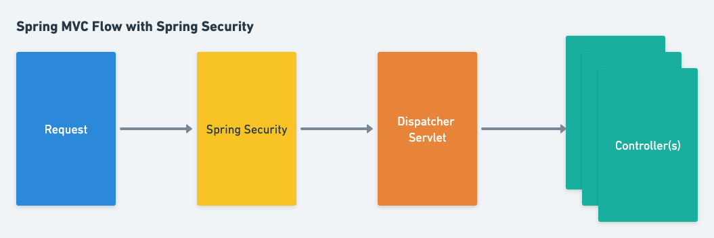
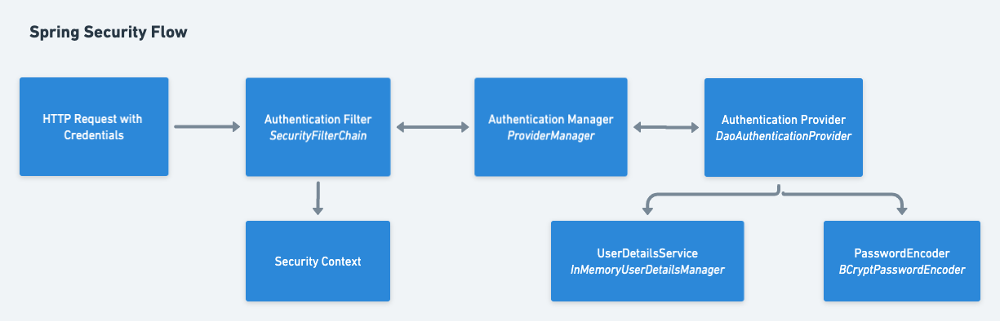

---

---
# Spring Security

## What is Spring Security
Spring Security is a framework dedicated to providing application security for Java applications in a flexible way. Spring Security addresses all the layers of security for your application. It is flexible, customizable and easy to use.

## Principles of Application Security

### Least Privilege

Principle of Least Privilege states that every user should only have just enough access to perform to perform their duties.

### Separation of Duties

The main idea behind Principle of Separation of Duties is that no single user or role should have too much authority. 

### Defense in Depth

It may be difficult to hack into a computer security system, but it never prevents a determined hacker from hacking into the system. So, always implement security in multiple layers and set up alerts for when the security system fails.

### Failing Securely

Principle of Failing Securely recognizes that all systems are bound to fail. This helps us to design systems that knows how to limit damage in case of any failures.

### Open Design

Principle of Open Design states that your system security should not rest on the secrecy of your implementation. This involves making the design process and the resulting application code accessible to a wider community, including other developers, security experts, and end-users. Develop your app in such a way that a hacker will not be able to exploit your app even if they gain access to the source code.

### Avoiding Security by Obscurity

Principle of Avoiding Security by Obscurity suggests that relying solely on the secrecy or obscurity of the credentials to provide security is not a reliable or effective approach. This means that security measures should not rely on the assumption that an attacker will not be able to discover the underlying details of a system or its components like a privileged username and password.

### Reduce Your Attack Surface

When designing an application, your goal should be to minimize the number of entry points for attackers.

## Key concepts in Application Security

### Authentication 
Authentication is the process of verifying that an individual, entity or website is whom it claims to be, by using a proof of identity. The proof of identity can be knowledge-based like ID and password, PIN number etc. It can also be possession-based like phone call/text message verification, key card/badges, access token device etc.

Now-a-days most applications and services offer multi-factor authentication, a combination of knowledge-based and possession-based authentication.


### Authorization 
Authorization may be defined as the process of verifying that a requested action or service is approved for a specific/principal. It is the second stage of access control, following authentication, which verifies the identity of the user or entity requesting access.

## Introduction to Spring Security


Spring Security works by providing a set of security filters that are applied to incoming requests to your application. These filters intercept the requests and perform various security checks and operations, such as verifying the user's identity, checking their permissions and roles, and managing user sessions.

Here's a high-level overview of how Spring Security works:

1. Intercepting incoming requests: When a request is made to your application, it is intercepted by a set of Spring Security filters.



2. Authentication: The first step in the security process is authentication, which verifies the user's identity by checking their credentials against a stored database or external authentication provider.

3. Authorization: Once the user has been authenticated, Spring Security checks their authorization to access the requested resource. Authorization is based on access control policies and rules that determine which users are allowed to access which resources.

4. Session Management: Spring Security also manages user sessions, which enable users to stay logged in to your application for a period of time. It provides a set of configurable session management features such as session timeout, session fixation prevention, and concurrent session control.

The following is a simplified view of Spring Security work flow:




### Authentication Manager

In Spring Security, the default AuthenticationManager is an instance of *ProviderManager*, which is an implementation of the *AuthenticationManager* interface.

The *ProviderManager* delegates authentication to a list of AuthenticationProvider instances. When an Authentication object is passed to the authenticate method of the AuthenticationManager, the *ProviderManager* will iterate through its list of AuthenticationProvider instances until one of them is able to authenticate the user. If no AuthenticationProvider can authenticate the user, an exception will be thrown.

The default AuthenticationManager is created automatically by Spring Security and is typically used when no custom authentication provider or AuthenticationManager implementation is specified. 

### Authentication Provider
In Spring Security, an authentication provider is responsible for authenticating a user's credentials and providing an authentication object that represents the user's identity and authorities.

Spring Security provides several authentication providers out of the box, such as:

1. DaoAuthenticationProvider: This provider authenticates a user against a database of user credentials. It takes a UserDetailsService as input, which retrieves user details from a database.

2. LdapAuthenticationProvider: This provider authenticates a user against an LDAP directory.

3. OpenIDAuthenticationProvider: This provider authenticates a user using OpenID.

In addition to these built-in authentication providers, Spring Security also allows you to create your own custom authentication providers by implementing the AuthenticationProvider interface.

When a user tries to access a secured resource, Spring Security first determines which authentication provider(s) to use based on the configured authentication mechanism(s), such as form-based login or HTTP Basic authentication. The authentication provider then attempts to authenticate the user's credentials and returns an authentication object if successful. If authentication fails, an exception is thrown, and the user is redirected to the login page.

## How to use Spring Security

### Add Spring Security Dependency

In order to start using Spring Security, all you have to do is add the Spring Security dependency to your Spring Boot application. 

In Spring boot maven application add the following dependency to your pom.xml:
```
    <dependency>
		<groupId>org.springframework.boot</groupId>
		<artifactId>spring-boot-starter-security</artifactId>
	</dependency>
```
If you are using Spring Security without Spring Boot, add the following dependency to your pom.xml:
```
    <dependency>
		<groupId>org.springframework.security</groupId>
		<artifactId>spring-security-web</artifactId>
        <version>VERSION</version>
	</dependency>
	<dependency>
		<groupId>org.springframework.security</groupId>
		<artifactId>spring-security-config</artifactId>
        <version>VERSION</version>
	</dependency>
```

Simply adding the dependency provides following security features and more to your application by default:

1. Form-based authentication for all URLs.
2. Single user with username = *user* and a autogenerated random password. 
3. Manages user sessions by default, with options to configure session fixation, session concurrency, and logout options.
4. Default URL patterns for authentication and authorization. For example, "/login" is the default URL for the login page, and "/logout" is the default URL for logging out.
5. Adds a login form with fields username and password.
6. Adds a logout page woth logout button.
7. Handles login error.

The default user credentials generated by Spring Security can be overridden by adding the properties to `application.properties` file.

```
    spring.security.user.name=foo
    spring.security.user.password=bar
```


##  Configuring Spring Security

Create a security configuration class and annotate it with *@EnableWebSecurity* and *@Configuration* annotations. 

```java

@EnableWebSecurity
@Configurationpragra123
public class SecurityConfig {
	...
}
```

### Security Filter Chain

In Spring Security, the security filter chain is a series of filters that intercept and process incoming HTTP requests to enforce security measures in a web application. The security filter chain is responsible for handling authentication, authorization, and other security-related tasks.

The security filter chain is comprised of a set of filter classes, each responsible for a specific security function such as authentication, authorization, CSRF protection, session management, and more. These filters work together in a specific order to apply the necessary security measures to incoming requests.

```java
@Bean
public SecurityFilterChain filterChain(HttpSecurity http) throws Exception {
    http.authorizeHttpRequests()
        .requestMatchers("/","/home").hasRole("ADMIN")
        .requestMatchers("/ca-en", "/ca-fr").hasAnyRole("ADMIN", "USER")
        .and().formLogin().and().csrf().disable();

    return http.build();
}

```

### Basic Authentication

Basic Authentication is a simple way to authenticate users using a username and password. It works by sending the user's credentials (username and password) in the HTTP request header using Base64 encoding. The server then decodes the credentials, verifies them, and either grants or denies access to the requested resource.

```java
@Bean
public SecurityFilterChain filterChain(HttpSecurity http) throws Exception {
    http.authorizeHttpRequests()
        anyRequest().authenticated()
        .and()
        .httpBasic();

    return http.build();
}
```

### Storing Credentials In-Memory

In-memory authentication is a method of authentication provided by Spring Security that stores user credentials in memory rather than in a database. With in-memory authentication, user information such as usernames, passwords, and roles are stored in an in-memory data structure such as a hash map or a list.

When a user attempts to authenticate, the *InMemoryUserDetailsManager* is used to retrieve their credentials from the in-memory data structure. If the credentials are valid, the user is authenticated and authorized based on their roles.

```java
@Bean
public InMemoryUserDetailsManager userDetailsService() {
    UserDetails user1 = User.withUsername("user1")
        .password(passwordEncoder().encode("password1"))
        .roles("USER")
        .build();
    UserDetails user2 = User.withUsername("user2")
        .password(passwordEncoder().encode("password2"))
        .roles("ADMIN")
        .build();
    return new InMemoryUserDetailsManager(user1, user2);
}

 @Bean
public PasswordEncoder passwordEncoder() {
    return new BCryptPasswordEncoder();
}
```

### Storing Credentials in JDBC

In Spring Security, storing user credentials in a JDBC database is a common approach for authentication. This involves storing user details, including their username and password, in a database table and configuring Spring Security to use the database for authentication.

To store user credentials in a JDBC database, you need to perform the following steps:


1. Add the JDBC and database(H2) dependencies.
```
<dependency>
    <groupId>org.springframework.boot</groupId>
    <artifactId>spring-boot-starter-jdbc</artifactId>
</dependency>
<dependency>
    <groupId>com.h2database</groupId>
    <artifactId>h2</artifactId>
</dependency>
```

2. Register the DataSource.
```java
@Bean
public DataSource dataSource(){
    return new EmbeddedDatabaseBuilder()
        .setType(EmbeddedDatabaseType.H2)
        .addScript(JdbcDaoImpl.DEFAULT_USER_SCHEMA_DDL_LOCATION)
        .build();
}
```
3. Implement the *UserDetailsService* interface to load user details from the database.

```java
@Bean
public UserDetailsService userDetailsService(DataSource dataSource){

    UserDetails user1 = User.withUsername("user1")
        .password(passwordEncoder().encode("password1"))
        .roles("ADMIN")
        .build();
    UserDetails user2 = User.withUsername("user2")
        .password(passwordEncoder().encode("password2"))
        .roles("USER")
        .build();
    JdbcUserDetailsManager jdbcUserDetailsManager = new JdbcUserDetailsManager(dataSource);
    jdbcUserDetailsManager.createUser(user1);
    jdbcUserDetailsManager.createUser(user2);

    return jdbcUserDetailsManager;
}   
```

### JWT Authentication with OAuth2 Resource Server

OAuth2 is a protocol used for authorization and authentication in web applications. It allows a user to grant a third-party application access to their resources without sharing their credentials. A resource server is a server that provides access to protected resources based on access tokens.

JWTs can be used as access tokens in OAuth2. The OAuth2 provider generates a JWT that represents the user's authentication and authorization details. This JWT is then used by the resource server to authorize requests.

Here is how JWT Authentication with OAuth2 Resource Server works:

1. The user authenticates with an OAuth2 provider and receives a JWT access token.
2. The user sends the access token with each request to the resource server.
3. The resource server validates the access token by verifying the JWT signature, expiration time, and any other claims.
4. If the access token is valid, the resource server grants access to the requested resources.

To implement JWT authentication in your application, complete the following steps:

1. Add the OAuth server dependency
```
<dependency>
	<groupId>org.springframework.boot</groupId>
	<artifactId>spring-boot-starter-oauth2-resource-server</artifactId>
</dependency>
```
2. Add the Oauth2 Resource server filter to the filter chain in the security configuration.
```java
@Bean
public SecurityFilterChain filterChain(HttpSecurity http) throws Exception {

    // filters...
    http.sessionManagement(
            session ->
                    session.sessionCreationPolicy(
                            SessionCreationPolicy.STATELESS)
    );
    http.csrf().disable();
    http.httpBasic();
    http.oauth2ResourceServer(OAuth2ResourceServerConfigurer::jwt);
   // filters...

} 
```

3. Configure the AuthenticationManager
```java
@Bean
    public AuthenticationManager authenticationManager(
            UserDetailsService userDetailsService) {
        var authenticationProvider = new DaoAuthenticationProvider();
        authenticationProvider.setUserDetailsService(userDetailsService);
        return new ProviderManager(authenticationProvider);
    }
```

4. Configure JWT encoder and decoder

```java
//Step 1: Create Key Pair
@Bean
public KeyPair keyPair() throws NoSuchAlgorithmException {
    KeyPairGenerator generator = KeyPairGenerator.getInstance("RSA");
    generator.initialize(2048);
    return generator.generateKeyPair();
}

//Step 2: Generate RSA Key with KeyPair
@Bean
public RSAKey rsaKey(KeyPair keyPair) throws NoSuchAlgorithmException {
    return new RSAKey.Builder((RSAPublicKey) keyPair.getPublic())
            .privateKey(keyPair().getPrivate())
            .keyID(UUID.randomUUID().toString())
            .build();
}

//Step 3: Create JWK Source(JSON Web Key Source)
@Bean
public JWKSource<SecurityContext> jwkSource(RSAKey rsaKey){
    JWKSet jwkSet = new JWKSet(rsaKey);
    return (jwkSelector, context) -> jwkSelector.select(jwkSet);
}

//Step 4: Use RSA Public Key for decoding
@Bean
public JwtDecoder jwtDecoder(RSAKey rsaKey) throws JOSEException {
    return NimbusJwtDecoder.withPublicKey(rsaKey.toRSAPublicKey())
            .build();
}

//Step 5: Use JWK source for encoding
@Bean
public JwtEncoder jwtEncoder(JWKSource jwkSource){
    return new NimbusJwtEncoder(jwkSource);
}
```

5. Configure the service

```java
public String generateToken(Authentication authentication){
        String scope = authentication.getAuthorities().stream()
                .map(a -> a.getAuthority())
                .collect(Collectors.joining(" "));
        JwtClaimsSet jwtClaimsSet = JwtClaimsSet.builder()
                .issuer("self")
                .issuedAt(Instant.now())
                .expiresAt(Instant.now().plusSeconds(60*5))
                .subject(authentication.getName())
                .claim("scope", scope)
                .build();
        return jwtEncoder.encode(JwtEncoderParameters.from(jwtClaimsSet)).getTokenValue();
    }
```

6. Configure the controller

```java
 @PostMapping("/authenticate")
    public ResponseEntity<JwtResponse> generateToken(@RequestBody JwtTokenRequest jwtTokenRequest){

        UsernamePasswordAuthenticationToken authenticationToken = new UsernamePasswordAuthenticationToken(
                jwtTokenRequest.username(), jwtTokenRequest.password());

        Authentication authentication = authenticationManager.authenticate(authenticationToken);
        String token = jwtTokenService.generateToken(authentication);

        return ResponseEntity.ok(new JwtResponse(token));
    }
```
JwtTokenRequest is a record with two strings: username and password. The JwtResponse is a record with just one string: message.

### Oauth2 Client Login

OAuth 2 is a protocol that enables secure delegated access to resources over the internet. It allows users to grant third-party applications access to their resources on a server without sharing their credentials.

In Spring Security, OAuth 2 support is provided through the Spring Security OAuth project, which is an extension of Spring Security that enables developers to add OAuth 2 authentication and authorization to their applications.

To use OAuth 2 with Spring Security, developers need to configure the framework to use an OAuth 2 provider, such as Google, Facebook, or GitHub. The provider will authenticate the user and issue an access token, which the user can use to access protected resources on the server.

To use OAuth 2, add Oauth2 dependency:
```java
<dependency>
	<groupId>org.springframework.boot</groupId>
	<artifactId>spring-boot-starter-oauth2-client</artifactId>
</dependency>
```

For a very naive implementation, configure the client-id and secret application.properties.
```
spring.security.oauth2.client.registration.google.client-id=YOUR_CLIENT_ID
spring.security.oauth2.client.registration.google.client-secret=YOUR_SECRET
```

Refer the OAuth 2 providers' official documentationfor guidance on how to create Client ID and secret.
Click  [here](https://support.google.com/workspacemigrate/answer/9222992?hl=en) for google  reference.

Note: Use http://localhost:8080/login/oauth2/code/google as Authorised redirect URIs

## Appendix

### JWT
JWT stands for JSON Web Token, which is a compact and self-contained way of transmitting information between parties in JSON format. JWTs are often used for authentication and authorization purposes in web applications and APIs.

### Key Pair
A key pair is a set of two related cryptographic keys, consisting of a public key and a private key, that are used for secure communication over an insecure network.

The public key is shared openly and can be used by anyone to encrypt data that can only be decrypted by the owner of the corresponding private key. The private key, on the other hand, is kept secret and is used to decrypt data that has been encrypted using the corresponding public key.

### RSA Key Object

RSA (Rivest-Shamir-Adleman) is a widely used public-key cryptography algorithm that can be used for encryption, digital signatures, and key exchange. An RSA key object is a data structure that contains the parameters and values necessary for RSA encryption or decryption.

### JWK Source

*JwkSource* is an interface in the Spring Security OAuth2 framework that defines a strategy for loading JSON Web Key (JWK) Sets used for validating JSON Web Tokens (JWTs).

#### JWK Set
A JSON Web Key (JWK) Set is a JSON object that represents a set of JWKs (JSON Web Keys). JWKs are used to represent cryptographic keys in JSON format, and can be used for various cryptographic operations, such as signing and encryption. A JWK Set is typically used to represent the public keys used to sign or encrypt JSON Web Tokens (JWTs). 